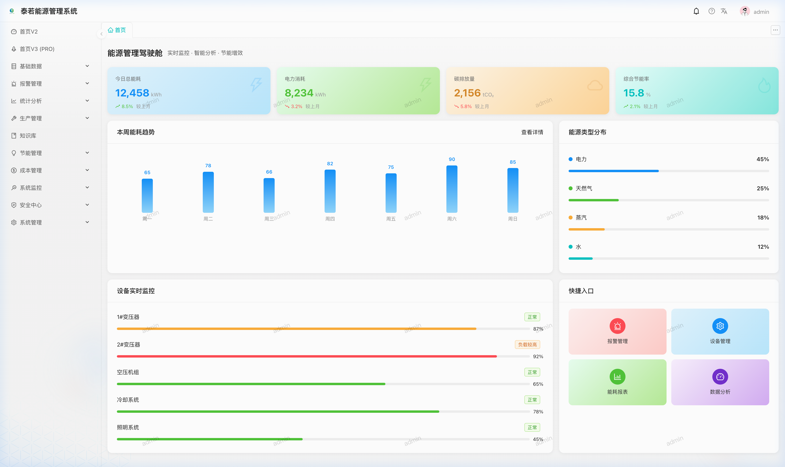
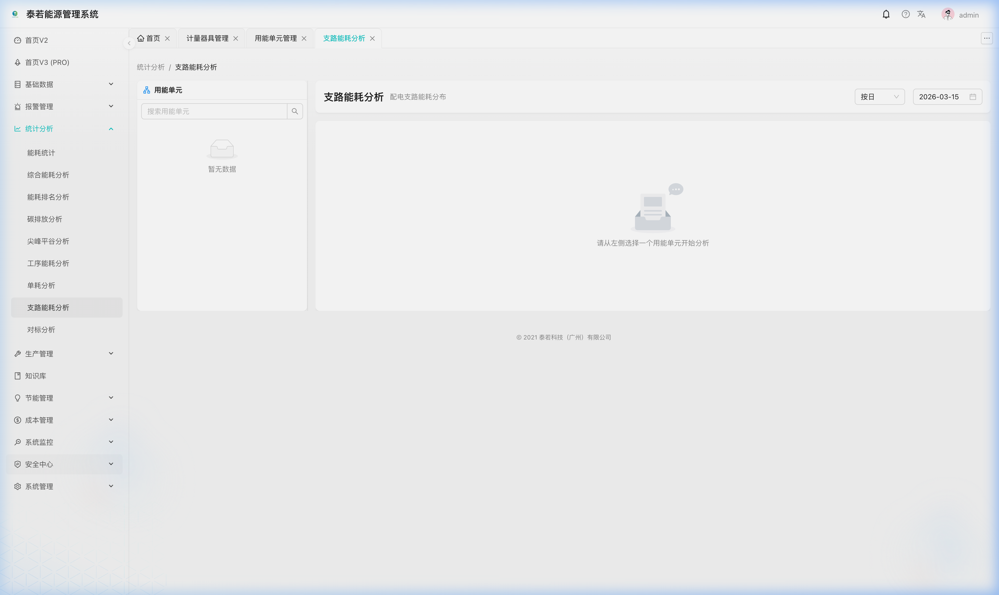
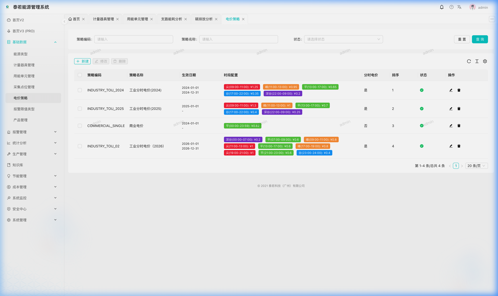
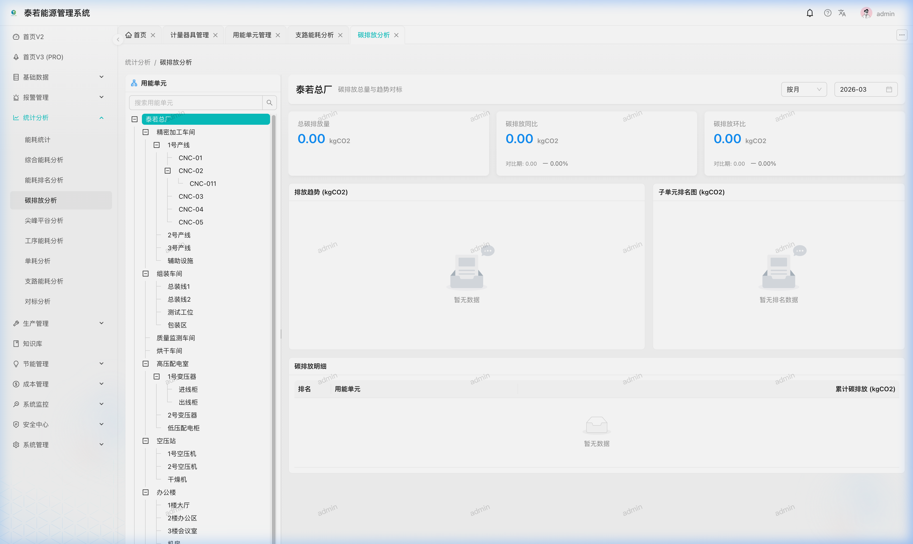

# Terra EMS Web — Frontend Application

<h3 align="center">
   Terra Energy Management System — Enterprise frontend based on React + Ant Design
</h3>

<p align="center">
  
  
  
  
  
  
</p>

### 🏗️ Design System & Architecture

```mermaid
graph LR
    UI[Ant Design 5.x / Pro Components] --> Hook[useCrud Custom Hook]
    Hook --> Request[@umijs/max/request]
    Request --> API[terra-ems API Service]
    API --> UI
```

<p align="center">
  <a href="./README.zh-CN.md">中文文档</a> | <span>English</span>
</p>

---

## 🖼️ System Screenshots

<p align="center">
  
  
</p>
<p align="center">
  
  
</p>

---

## 📋 Introduction

<p align="center">
  
</p>

Terra EMS Web is the frontend application for the Terra Energy Management System, built on **Ant Design Pro** and **UmiJS 4**. It provides an industrial-grade management interface optimized for **IoT scenarios**, supporting one-click site deployment via **YAML configuration**, real-time energy dashboards, carbon footprint tracking, and a modern UI experience.

> 📦 Backend Repository: [terra-ems](https://github.com/dengxp/terra-ems)

## 🚀 Online Demo

*   **URL**: [http://terra-ems.com](http://terra-ems.com)
*   **Username**: `admin`
*   **Password**: `admin123`

> [!TIP]
> **Frontend Innovation: Zero-Code Initialization**:
> In sync with the backend's "Code-as-Config" philosophy, the frontend now supports full-site YAML import. Engineers can skip tedious manual configurations and simply drag-and-drop a file to initialize complex multi-level site hierarchies instantly.

---

## ✨ Modules

### Energy Management
*   🔋 **Base Data**: Energy types, units, meters, sampling points.
*   🚀 **Fast Deploy**: **One-click YAML Site Import**, Auto-initialization.
*   📊 **Analytics**: Consumption trends, YoY/MoM analysis, rankings, dashboards.
*   ⚡ **Peak & Valley**: Price configuration and TOU analysis charts.
*   🌍 **Carbon**: Emission calc and footprint visualization.
*   🎯 **Benchmarks**: Comparison against national/industry standards.
*   ⚠️ **Alerts**: Real-time alarm monitoring and processing workflow.

### System Management
*   👤 **Users & Roles**: RBAC with fine-grained permission control.
*   🏢 **Organization**: Tree-based department and post management.
*   📝 **System**: Menu configuration, dictionaries, and global parameters.
*   📋 **Logs**: Login and operation behavior auditing.

---

## 🛠️ Tech Stack

| Category | Technology | Version |
|:---|:---|:---|
| **Core** | React | 18 |
| **Framework** | UmiJS (`@umijs/max`) | 4.6+ |
| **UI Library** | Ant Design | 5.29+ |
| **Language** | TypeScript | 5.3+ |
| **Charts** | ECharts | 6.0 |
| **CSS** | Less + TailwindCSS | — |
| **Package Mgmt** | pnpm | — |

---

## 📁 Project Structure

```
terra-ems-web/
├── config/                     # Project config (routes, proxy, settings)
├── public/                     # Static assets
├── src/
│   ├── apis/                   # Modular API definitions
│   ├── pages/                  # Business pages
│   ├── components/             # Reusable UI components (AddButton, etc.)
│   ├── hooks/                  # Common hooks (useCrud)
│   ├── models/                 # Global state (DVA)
│   ├── locales/                # I18n support
│   └── utils/                  # Utility functions
├── package.json
└── tailwind.config.js
```

---

## 🚀 Quick Start

### Prerequisites
*   Node.js >= 22
*   pnpm >= 9

### 1. Installation
```bash
git clone https://github.com/dengxp/terra-ems-web.git
cd terra-ems-web
pnpm install
```

### 2. Development
```bash
# Connect to backend API (Mock disabled)
pnpm run dev
```
Open **http://localhost:8000**

---

## 🤝 Contribution & Feedback

We welcome bug reports and suggestions via [Issues](https://github.com/dengxp/terra-ems-web/issues).

> [!IMPORTANT]
> **About Pull Requests (PR)**:
> To maintain strict UI standards and architectural consistency, **we are not currently accepting external code contributions (Pull Requests)**. We encourage developers to share their ideas through Issues.

---

## 📜 License

[MIT License](LICENSE) — Copyright © 2025-2026 Terra Technology (Guangzhou) Co., Ltd.
