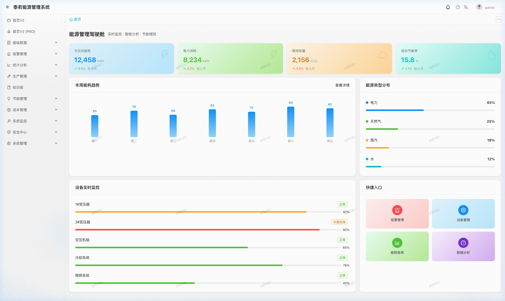
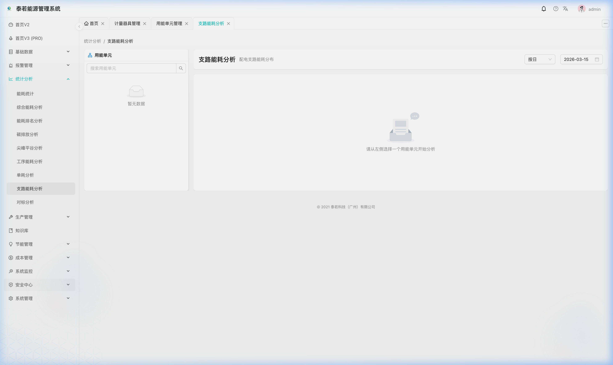
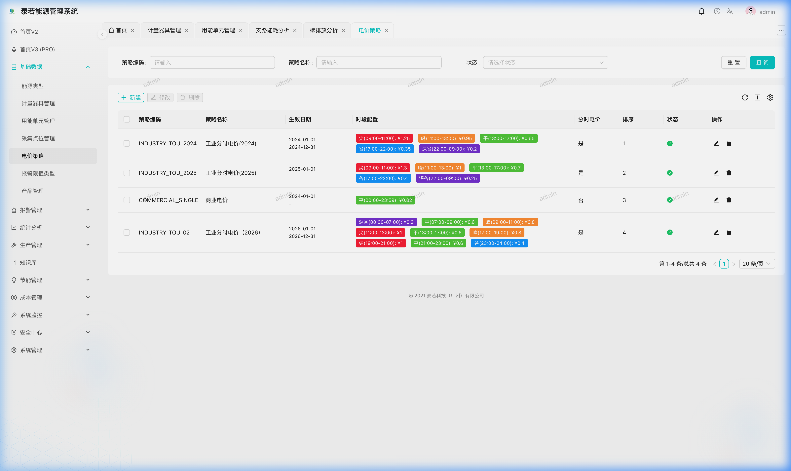
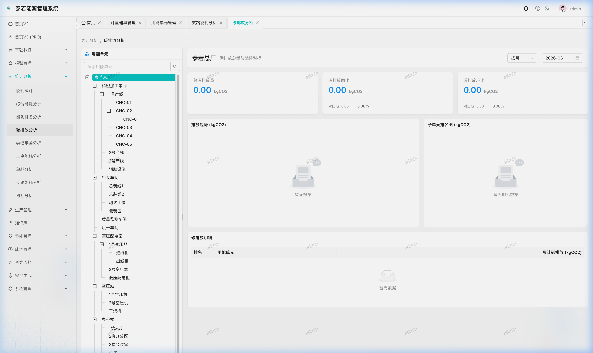

# Terra EMS Web — 前端应用

<p align="center">
  <strong>🌿 Terra 能源管理系统 — 基于 React + Ant Design 的企业级前端</strong>
</p>

<p align="center">
  
  
  
  
  
  
</p>

### 🏗️ 技术架构图

```mermaid
graph LR
    UI[Ant Design 5.x / Pro Components] --> Hook[useCrud 通用 Hook]
    Hook --> Request[@umijs/max/request]
    Request --> API[terra-ems 后端服务]
    API --> UI
```

---

## 🖼️ 系统截图展示

<p align="center">
  
  
</p>
<p align="center">
  
  
</p>

---

## 📋 项目简介

Terra EMS Web 是 Terra 能源管理系统的前端应用，基于 **Ant Design Pro** 脚手架构建，采用 **UmiJS 4** 企业级前端框架，提供开箱即用的中后台管理界面。本应用包含完整的能源管理业务页面、数据可视化图表、权限控制体系，以及现代化的 UI 交互体验。

> 📦 后端仓库：[terra-ems](https://github.com/dengxp/terra-ems)

## 🚀 在线演示

*   **演示地址**：[在线演示](https://terra-ems.com)
*   **账号**：`admin`
*   **密码**：`admin123`

> [!TIP]
> **不仅是 EMS，更是一个完备的 Web 开发基座**：
> Terra EMS 建立在极度标准化的 React + TypeScript 架构之上，封装了类似 RuoYi (若依) 的权限体系和高度抽象的 `useCrud` 逻辑。它不仅适用于能源管理，也可以作为一个通用的企业级中后台开发基座，帮助您极速开发各类业务管理系统。

---

## ✨ 功能模块

### 能源管理

| 模块 | 页面 | 说明 |
|:---|:---|:---|
| 🔋 **基础数据** | 能源类型 / 用能单元 / 计量器具 / 采集点位 | 完整 CRUD + 树形结构管理 |
| 📊 **统计分析** | 能耗趋势 / 同比环比 / 排名分析 / 综合看板 | ECharts 数据可视化 |
| ⚡ **峰谷分析** | 分时电价配置 / 尖峰平谷用电量分析 | 多维度图表展示 |
| 💰 **成本管理** | 电价策略 / 成本绑定 / 成本记录 | 成本偏差分析 |
| 🌍 **碳排放** | 碳排放核算 / 趋势分析 / 排名 | 碳排放可视化 |
| 🎯 **对标管理** | 对标值配置（国标/行标/企标） | 多标准体系支持 |
| 🌱 **节能管理** | 节能项目跟踪 / 政策法规 | 全生命周期管理 |
| ⚠️ **告警管理** | 限值类型 / 告警配置 / 告警记录 | 多级告警、处理闭环 |
| 📖 **知识库** | 知识文章管理 | Markdown 编辑器 |
| 🏭 **生产管理** | 产品信息 / 生产记录 | 关联用能单元 |

### 系统管理

| 模块 | 说明 |
|:---|:---|
| 👤 用户管理 | 用户 CRUD、角色分配、头像管理 |
| 🔑 角色管理 | 角色权限配置、数据范围 |
| 🏢 部门管理 | 树形部门结构 |
| 📋 岗位管理 | 岗位配置 |
| 📑 菜单管理 | 动态菜单配置 |
| 🛡️ 权限管理 | 细粒度权限控制 |
| 📝 字典管理 | 字典类型 / 字典数据 |
| ⚙️ 系统配置 | 全局参数配置 |
| 🔔 通知公告 | 通知公告管理 |

### 系统监控

| 模块 | 说明 |
|:---|:---|
| 📋 登录日志 | 登录行为审计 |
| 📋 操作日志 | 操作行为追踪 |

---

## 🛠️ 技术栈

| 类别 | 技术 | 版本 |
|:---|:---|:---|
| **核心框架** | React | 18 |
| **前端框架** | UmiJS (`@umijs/max`) | 4.6+ |
| **UI 组件库** | Ant Design | 5.29+ |
| **高级组件** | Ant Design Pro Components | 2.8+ |
| **语言** | TypeScript | 5.3+ |
| **图表可视化** | ECharts + ECharts for React | 6.0 |
| **Markdown** | md-editor-rt | 6.3 |
| **样式方案** | Less + TailwindCSS + antd-style | — |
| **状态管理** | useModel (DVA 简版) | — |
| **权限控制** | Access + useAccess | — |
| **HTTP 请求** | @umijs/max `request` | — |
| **包管理** | pnpm | — |

---

## 📁 项目结构

```
terra-ems-web/
├── config/                     # 项目配置 (routes, proxy, settings)
├── public/                     # 静态资源
├── src/
│   ├── apis/                   # API 模块化定义
│   ├── pages/                  # 业务页面
│   │   ├── BasicData/          # 基础数据模块
│   │   ├── Statistics/         # 统计分析模块
│   │   ├── CostManagement/     # 成本管理模块
│   │   ├── system/             # 系统管理模块
│   │   └── ...                 # 其他业务模块
│   ├── components/             # 公共 UI 组件 (AddButton, EditButton 等)
│   ├── hooks/                  # 通用 Hooks (含 useCrud)
│   ├── models/                 # 全局状态 (DVA)
│   ├── locales/                # 国际化支持
│   ├── utils/                  # 工具函数
│   └── requestErrorConfig.ts   # 全局请求拦截与异常处理
├── tailwind.config.js          # TailwindCSS 配置
└── package.json
```

---

## 🚀 快速开始

### 环境要求

| 环境 | 最低版本 | 推荐版本 |
|:---|:---|:---|
| Node.js | 16 | 22+ |
| pnpm | 8 | 9+ |

### 1. 安装依赖

```bash
# 克隆项目
git clone https://github.com/dengxp/terra-ems-web.git
cd terra-ems-web

# 安装依赖
pnpm install
```

### 2. 启动开发服务器

```bash
# 开发模式（连接本地后端 API，关闭 Mock）
pnpm run dev

# 或使用 Mock 数据
pnpm run start
```

开发服务器启动后访问：**http://localhost:8000**

---

## 🔧 开发约定

### CRUD 开发规范

所有标准 CRUD 页面**强制使用** `useCrud` Hook：

```tsx
const { getState, actionRef, search, toCreate, toEdit,
        handleSaveOrUpdate, toBatchDelete, setDialogVisible } = useCrud<Entity>({
  pathname: '/module/page',
  entityName: '实体名称',
  baseUrl: '/api/entities',
});
```

### 组件规范

- 操作按钮使用封装组件：`AddButton` / `EditButton` / `DeleteButton` / `IconButton`
- 表单布局：所有表单开启 `grid={true}`，`rowProps={{ gutter: 0 }}`
- ID 等技术字段使用 `ProFormText` + `hidden` 隐式提交

---

## 🤝 贡献与反馈

我们非常欢迎通过 [Issues](https://github.com/dengxp/terra-ems-web/issues) 提交 Bug 报告、功能建议或使用咨询。

> [!IMPORTANT]
> **关于代码提交（PR）**：
> 为确保前端 UI 规范与逻辑架构的高度一致性，**目前本项目暂不接受外部代码提交（Pull Requests）**。我们鼓励开发者通过 Issue 分享改进想法。

---

## 📜 开源协议

[MIT License](LICENSE) — Copyright © 2025-2026 泰若科技（广州）有限公司
